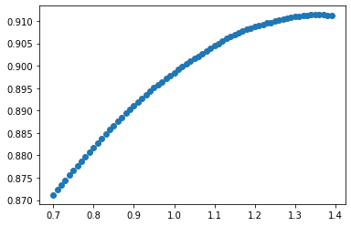
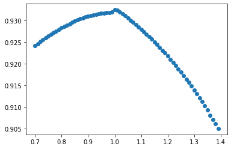
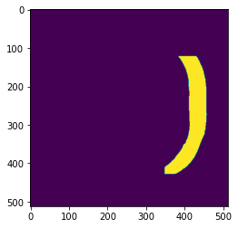
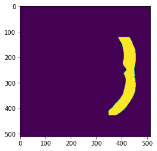

```python
import os
os.environ['CUDA_VISIBLE_DEVICES'] = '1'
```


```python
import io
import matplotlib.pyplot as plt
import nrrd
import numpy as np
import sqlite3 as sql
import tensorflow as tf
import time
from metrics import hd
from skimage import transform, measure
from tensorflow import keras
from tensorflow.keras import layers
```


```python
def adapt_ndarray(data):
    out_data = io.BytesIO()
    np.savez_compressed(out_data, data=data)
    out_data.seek(0)
    return sql.Binary(out_data.read())
def convert_ndarray(data):
    out_data = io.BytesIO(data)
    out_data.seek(0)
    return np.load(out_data)['data']
sql.register_adapter(np.ndarray, adapt_ndarray)
sql.register_converter('ndarray', convert_ndarray)
```


```python
def build_model(conf):
    with open(os.path.join(conf['prefix'], conf['model']), 'r') as f:
        model = keras.models.model_from_json(f.read())
    model.load_weights(os.path.join(conf['prefix'], conf['weights']))
    return model
```


```python
def run_model(model, data):
    data = np.expand_dims(data, 0)
    ret = model.predict(data)[0]
    return ret
```


```python
# Final
d2_x = {
    'prefix': os.path.join('Cross/Final', 'X', 'MX-1'),
    'model': 'mx-1.json',
    'weights': 'my-0.060315-0.041710.h5'
}
d2_y = {
    'prefix': os.path.join('Cross/Final', 'Y', 'MY-1'),
    'model': 'my-1.json',
    'weights': 'my-0.077829-0.047107.h5'
}
d2_z = {
    'prefix': os.path.join('Cross/Final', 'Z', 'MZ-1'),
    'model': 'mz-1.json',
    'weights': 'my-0.092671-0.055157.h5'
}
```


```python
# Extra
d2_x = {
    'prefix': os.path.join('Cross/Extra', 'X', 'MX-1'),
    'model': 'mx-1.json',
    'weights': 'my-0.061415-0.069972.h5'
}
d2_y = {
    'prefix': os.path.join('Cross/Extra', 'Y', 'MY-1'),
    'model': 'my-1.json',
    'weights': 'my-0.076656-0.053878.h5'
}
```


```python
# 00~29
d2_x = {
    'prefix': os.path.join('Cross/00~29', 'X', 'MX-1'),
    'model': 'mx-1.json',
    'weights': 'my-0.071419-0.050334.h5'
}
d2_y = {
    'prefix': os.path.join('Cross/00~29', 'Y', 'MY-1'),
    'model': 'my-1.json',
    'weights': 'my-0.075665-0.049306.h5'
}
d2_z = {
    'prefix': os.path.join('Cross/00~29', 'Z', 'MZ-1'),
    'model': 'mz-1.json',
    'weights': 'my-0.080608-0.062642.h5'
}
```


```python
# 30~69
d2_x = {
    'prefix': os.path.join('Cross/30~69', 'X', 'MX-1'),
    'model': 'mx-1.json',
    'weights': 'my-0.067156-0.051174.h5'
}
d2_y = {
    'prefix': os.path.join('Cross/30~69', 'Y', 'MY-1'),
    'model': 'my-1.json',
    'weights': 'my-0.074882-0.049612.h5'
}
d2_z = {
    'prefix': os.path.join('Cross/30~69', 'Z', 'MZ-1'),
    'model': 'mz-1.json',
    'weights': 'my-0.079545-0.057017.h5'
}
```


```python
# 70~99
d2_x = {
    'prefix': os.path.join('Candidate', 'X', 'MX-1'),
    'model': 'mx-1.json',
    'weights': 'my-0.062206-0.049892.h5'
}
d2_y = {
    'prefix': os.path.join('Candidate', 'Y', 'MY-2'),
    'model': 'my-2.json',
    'weights': 'my-0.075179-0.053072.h5'
}
d2_z = {
    'prefix': os.path.join('Candidate', 'Z', 'MZ-1'),
    'model': 'mz-1.json',
    'weights': 'my-0.089226-0.043636.h5'
}
```


```python
d2_x_m = build_model(d2_x)
d2_y_m = build_model(d2_y)
# d2_z_m = build_model(d2_z)
```


```python
db_prefix = '/media/home/ECD69CAAD69C7694/2020SummerBackup'
conn = sql.connect(os.path.join(db_prefix, 'd2_result.db'), detect_types=sql.PARSE_DECLTYPES)
conn2 = sql.connect(os.path.join(db_prefix, 'd2_result2.db'), detect_types=sql.PARSE_DECLTYPES)
cur = conn.cursor()
cur2 = conn2.cursor()
```


```python
cur.execute('''
    create table if not exists d2_result (
        item_id integer primary key,
        obj_id integer, off_id integer,
        pre_ext ndarray, rel_ext ndarray
    )
''')
```


    <sqlite3.Cursor at 0x7fdb9890cce0>


```python
cur.execute('''
    create table if not exists d2_result_f (
        item_id integer primary key,
        obj_id integer,
        pre_ext ndarray, rel_ext ndarray
    )
''')
```


    <sqlite3.Cursor at 0x7fdb9890cce0>


```python
def get_data(ID):
    prefix = '/home/home/2020summer/training_set'
    com_data, info = nrrd.read(os.path.join(prefix, 'complete_skull', f'{ID:03d}.nrrd'))
    def_data, info = nrrd.read(os.path.join(prefix, 'defective_skull', f'{ID:03d}.nrrd'))
    imp_data, info = nrrd.read(os.path.join(prefix, 'implant', f'{ID:03d}.nrrd'))
    return com_data, def_data, imp_data, info
```


```python
def get_test_data(ID):
    prefix = '/home/home/2020summer/training_set/test_set_for_participants'
    def_data, info = nrrd.read(os.path.join(prefix, f'{ID:03d}.nrrd'))
    return def_data, info
```


```python
def get_valid_shape_d3(data):
    x_info = [np.any(data[x, ...]) for x in range(data.shape[0])]
    y_info = [np.any(data[:, y, :]) for y in range(data.shape[1])]
    z_info = [np.any(data[..., z]) for z in range(data.shape[2])]
    x_info = np.where(x_info)[0]
    y_info = np.where(y_info)[0]
    z_info = np.where(z_info)[0]
    return (x_info[0], x_info[-1]+1, y_info[0], y_info[-1]+1, z_info[0], z_info[-1]+1)
```


```python
def get_extend_d2(data, geo_info, target_shape=(512, 512)):
    xmin, xmax, ymin, ymax = geo_info
    ori = data[xmin:xmax, ymin:ymax].astype('float32')
    ret = transform.resize(ori, target_shape)
    ret = (ret>=.5).astype('bool')
    return ret
```


```python
def get_extend_d3(data, geo_info, target_shape=(512, 512, 512)):
    xmin, xmax, ymin, ymax, zmin, zmax = geo_info
    ori = data[xmin:xmax, ymin:ymax, zmin:zmax].astype('float32')
    ret = transform.resize(ori, target_shape)
    ret = (ret>=.5).astype('bool')
    return ret
```


```python
def inv_extend_d3(data, geo_info, origin_shape=(512, 512, 512)):
    xmin, xmax, ymin, ymax, zmin, zmax = geo_info
    xlen, ylen, zlen = xmax-xmin, ymax-ymin, zmax-zmin
    ori = transform.resize(data, (xlen, ylen, zlen))
    ret = np.zeros(origin_shape, dtype='float32')
    ret[xmin:xmax, ymin:ymax, zmin:zmax] = ori
    return ret
```


```python
def get_max_region(data):
    ret, num = measure.label(data, return_num=True)
    max_region = None
    max_count = 0
    for l in range(1, num+1):
        region = (ret==l)
        count = np.count_nonzero(region)
        if count > max_count:
            max_count = count
            max_region = region
    return max_region
```


```python
def calc_dsc(y, py):
    tp = np.count_nonzero(np.logical_and(y, py))
    _sum = np.count_nonzero(y)+np.count_nonzero(py)
    return 2*tp/_sum
```


```python
def predict_x(def_data, geo_info, imp_data=None, extend=True):
    shape = def_data.shape
    x_info = [geo_info[i] for i in [2, 3, 4, 5]]
    ret = np.zeros((shape[0], 512, 512), dtype='float32')
    for k in range(shape[0]):
        if imp_data is not None:
            if not np.any(imp_data[k]):
                continue
        elif k < 161 or k >= 351:
            continue
        def_slc = get_extend_d2(def_data[k], x_info)
        imp_slc = run_model(d2_x_m, def_slc)
        ret[k] = imp_slc
    xmin, xmax = geo_info[0], geo_info[1]
    if extend == True:
        ret = transform.resize(ret[xmin:xmax], (512, 512, 512))
    return ret
```


```python
def predict_y(def_data, geo_info, imp_data, extend=True):
    shape = def_data.shape
    y_info = [geo_info[i] for i in [0, 1, 4, 5]]
    ret = np.zeros((512, shape[1], 512), dtype='float32')
    for k in range(shape[1]):
        if not np.any(imp_data[:, k, :]):
            continue
        def_slc = get_extend_d2(def_data[:, k, :], y_info)
        imp_slc = run_model(d2_y_m, def_slc)
        ret[:, k, :] = imp_slc
    ymin, ymax = geo_info[2], geo_info[3]
    if extend == True:
        ret = transform.resize(ret[:, ymin:ymax, :], (512, 512, 512))
    return ret
```


```python
def predict_z(def_data, geo_info, imp_data, extend=True):
    shape = def_data.shape
    z_info = [geo_info[i] for i in [0, 1, 2, 3]]
    ret = np.zeros((512, 512, shape[2]), dtype='float32')
    for k in range(shape[2]):
        if not np.any(imp_data[..., k]):
            continue
        def_slc = get_extend_d2(def_data[..., k], z_info)
        imp_slc = run_model(d2_z_m, def_slc)
        ret[..., k] = imp_slc
    zmin, zmax = geo_info[4], geo_info[5]
    if extend == True:
        ret = transform.resize(ret[..., zmin:zmax], (512, 512, 512))
    return ret
```


```python
def real_predict(def_data):
    geo_info = get_valid_shape_d3(def_data)
    retx = predict_x(def_data, geo_info)
    imp_data = inv_extend_d3(retx, geo_info)>=.5
    imp_data = get_max_region(imp_data)
    rety = predict_y(def_data, geo_info, imp_data)
    retz = predict_z(def_data, geo_info, imp_data)
    imp_data = inv_extend_d3(retx+rety+retz, geo_info)>=1.5
    imp_data = get_max_region(imp_data[..., :def_data.shape[-1]])
    union_region = imp_data&def_data
    imp_data = imp_data^union_region
    return imp_data
```


```python
def real_predict2(def_data):
    geo_info = get_valid_shape_d3(def_data)
    retx = predict_x(def_data, geo_info)
    imp_data = inv_extend_d3(retx, geo_info)>=.5
    imp_data = get_max_region(imp_data)
    rety = predict_y(def_data, geo_info, imp_data)
    return inv_extend_d3(retx+rety, geo_info)[..., :def_data.shape[-1]]
    imp_data = inv_extend_d3(retx+rety, geo_info)>=1.
    imp_data = get_max_region(imp_data[..., :def_data.shape[-1]])
    union_region = imp_data&def_data
    imp_data = imp_data^union_region
    return imp_data
```


```python
_, def_data, imp_data, info = get_data(39)
```


```python
ret = real_predict2(def_data)
```


```python
th_list = np.arange(.7, 1.4, 0.01)
```


```python
dsc = [calc_dsc(ret>=th, imp_data) for th in th_list]
```


```python
plt.scatter(th_list, dsc)
```


    <matplotlib.collections.PathCollection at 0x7f715050b310>





```python
# dsctot = np.zeros((10, 70))
```


```python
dsctot[3] = dsc
```


```python
plt.scatter(th_list, np.mean(dsctot, axis=0))
```


    <matplotlib.collections.PathCollection at 0x7f714834e6d0>





```python
with open('tmp.npz', 'wb') as f:
    np.savez(f, data=dsctot)
```


```python
dsc_list = []
hd_list = []
for z in [i for i in range(100) if i%10 >= 9]:
    _, def_data, imp_data, info = get_data(z)
    start = time.time()
    ret = real_predict(def_data)
    end = time.time()
    nrrd.write(os.path.join('tmp_result', f'{z:03d}.nrrd'), ret.astype('int32'), info)
    dsc_list.append(calc_dsc(ret, imp_data))
    hd_list.append(hd(imp_data, ret, voxelspacing=np.diag(info['space directions'])))
    print(f'{z:03d}: dsc:{dsc_list[-1]:.5f}, hd:{hd_list[-1]:.5f}, time:{(end-start):.5f}')
```

    009: dsc:0.83164, hd:5.04277, time:69.73366
    019: dsc:0.95757, hd:5.35492, time:81.95328
    029: dsc:0.94852, hd:2.25000, time:66.15298
    039: dsc:0.89369, hd:2.49659, time:76.97364
    049: dsc:0.94779, hd:4.08121, time:85.72232
    059: dsc:0.94416, hd:2.49983, time:59.43477
    069: dsc:0.93505, hd:3.35390, time:62.95045
    079: dsc:0.96049, hd:1.93753, time:60.45133
    089: dsc:0.91405, hd:4.41701, time:63.74930
    099: dsc:0.94904, hd:2.74280, time:62.11743
    


```python
z = 46
def_data, info = get_test_data(z)
ret = real_predict2(def_data)
nrrd.write(os.path.join('result_xy', f'{z:03d}.nrrd'), ret.astype('int32'), info)
```


```python
for z in range(100):
    def_data, info = get_test_data(z)
    start = time.time()
    ret = real_predict2(def_data)
    end = time.time()
    nrrd.write(os.path.join('result_xy', f'{z:03d}.nrrd'), ret.astype('int32'), info)
    print(f'{z:03d} finished, time:{(end-start):.5f}')
```

    000 finished, time:41.51010
    001 finished, time:41.34822
    002 finished, time:46.27019
    003 finished, time:45.39191
    004 finished, time:41.96869
    005 finished, time:45.19220
    006 finished, time:42.77206
    007 finished, time:42.78340
    008 finished, time:43.15385
    009 finished, time:40.27770
    010 finished, time:39.06649
    011 finished, time:46.78064
    012 finished, time:42.29406
    013 finished, time:40.36097
    014 finished, time:44.59453
    015 finished, time:40.88788
    016 finished, time:41.47024
    017 finished, time:41.27469
    018 finished, time:43.88908
    019 finished, time:42.14657
    020 finished, time:39.87106
    021 finished, time:39.81001
    022 finished, time:41.77322
    023 finished, time:40.76356
    024 finished, time:41.59313
    025 finished, time:40.96110
    026 finished, time:41.38795
    027 finished, time:40.57042
    028 finished, time:40.18830
    029 finished, time:41.05227
    030 finished, time:40.26756
    031 finished, time:39.94912
    032 finished, time:41.15244
    033 finished, time:40.12195
    034 finished, time:42.56896
    035 finished, time:42.08888
    036 finished, time:40.74961
    037 finished, time:40.33568
    038 finished, time:40.86605
    039 finished, time:40.89977
    040 finished, time:40.28781
    041 finished, time:42.03469
    042 finished, time:42.31336
    043 finished, time:42.05180
    044 finished, time:40.67015
    045 finished, time:41.30115
    046 finished, time:39.01497
    047 finished, time:39.21679
    048 finished, time:40.67018
    049 finished, time:42.65951
    050 finished, time:41.63055
    051 finished, time:40.06026
    052 finished, time:40.84060
    053 finished, time:41.76149
    054 finished, time:40.96560
    055 finished, time:40.61901
    056 finished, time:39.37545
    057 finished, time:38.57300
    058 finished, time:39.83533
    059 finished, time:41.40078
    060 finished, time:39.94707
    061 finished, time:41.67521
    062 finished, time:45.38333
    063 finished, time:41.26584
    064 finished, time:42.22222
    065 finished, time:40.60322
    066 finished, time:43.68271
    067 finished, time:44.64116
    068 finished, time:42.06511
    069 finished, time:40.50978
    070 finished, time:40.77094
    071 finished, time:42.90507
    072 finished, time:45.54485
    073 finished, time:41.21527
    074 finished, time:41.43992
    075 finished, time:41.12388
    076 finished, time:43.76811
    077 finished, time:41.48974
    078 finished, time:40.65430
    079 finished, time:41.27195
    080 finished, time:41.20713
    081 finished, time:41.73162
    082 finished, time:43.20380
    083 finished, time:41.32700
    084 finished, time:39.72756
    085 finished, time:39.87645
    086 finished, time:41.71656
    087 finished, time:41.16534
    088 finished, time:42.22811
    089 finished, time:37.30890
    090 finished, time:42.80898
    091 finished, time:42.23966
    092 finished, time:39.04741
    093 finished, time:39.41293
    094 finished, time:39.98290
    095 finished, time:39.52435
    096 finished, time:44.53222
    097 finished, time:40.86410
    098 finished, time:43.45017
    099 finished, time:41.61956
    


```python
np.std(dsc_list)
```


    0.021137010582131296


```python
for z in [20]:
    _, def_data, imp_data, info = get_data(z)
    ret = real_predict(def_data)
    print(calc_dsc(ret, imp_data))
    print(hd(imp_data, ret, voxelspacing=np.diag(info['space directions'])))
```

    0.9487929419909146
    4.8626843469034675
    


```python
dscx_list = []
dscy_list = []
dscz_list = []
dsc_list = []
for z in range(30):
    _, def_data, imp_data, info = get_data(z)
    geo_info = get_valid_shape_d3(def_data)
    retx = predict_x(def_data, imp_data, geo_info)
    rety = predict_y(def_data, imp_data, geo_info)
    retz = predict_z(def_data, imp_data, geo_info)
    imp_ext = get_extend_d3(imp_data, geo_info)
    dscx_list.append(calc_dsc(imp_ext, retx>=.5))
    dscy_list.append(calc_dsc(imp_ext, rety>=.5))
    dscz_list.append(calc_dsc(imp_ext, retz>=.5))
    dsc_list.append(calc_dsc(imp_ext, (retx+rety+retz)>=1.5))
    print(f'{z:03d}: x:{dscx_list[-1]:.5f} y:{dscy_list[-1]:.5f}, z:{dscz_list[-1]:.5f}, g:{dsc_list[-1]:.5f}')
```

    000: x:0.94061 y:0.93844, z:0.92656, g:0.94875
    001: x:0.91913 y:0.90628, z:0.90337, g:0.94304
    002: x:0.87016 y:0.93783, z:0.86949, g:0.94968
    003: x:0.91881 y:0.93332, z:0.91180, g:0.95535
    004: x:0.83437 y:0.93172, z:0.89635, g:0.94251
    005: x:0.89977 y:0.90479, z:0.91043, g:0.93557
    006: x:0.93275 y:0.90316, z:0.89503, g:0.93937
    007: x:0.94946 y:0.94974, z:0.92984, g:0.95633
    008: x:0.83959 y:0.89230, z:0.87327, g:0.92881
    009: x:0.86035 y:0.79833, z:0.75980, g:0.84427
    010: x:0.94892 y:0.90841, z:0.91637, g:0.94383
    011: x:0.95266 y:0.90794, z:0.89300, g:0.93993
    012: x:0.94230 y:0.87580, z:0.87905, g:0.92477
    013: x:0.89632 y:0.82658, z:0.89583, g:0.88902
    014: x:0.88624 y:0.90892, z:0.91427, g:0.93289
    015: x:0.93966 y:0.91471, z:0.92521, g:0.95366
    016: x:0.93137 y:0.88292, z:0.92417, g:0.93914
    017: x:0.86841 y:0.86928, z:0.85780, g:0.90792
    018: x:0.87384 y:0.77725, z:0.79175, g:0.86001
    019: x:0.92013 y:0.94105, z:0.92983, g:0.94836
    020: x:0.91807 y:0.93135, z:0.93012, g:0.94732
    021: x:0.90463 y:0.91488, z:0.91514, g:0.92899
    022: x:0.92763 y:0.91292, z:0.89931, g:0.93379
    023: x:0.84434 y:0.84481, z:0.84991, g:0.90441
    024: x:0.94727 y:0.93396, z:0.92616, g:0.94996
    025: x:0.89597 y:0.91622, z:0.85937, g:0.94053
    026: x:0.92373 y:0.92975, z:0.90794, g:0.94087
    027: x:0.91121 y:0.93492, z:0.92895, g:0.94185
    028: x:0.91098 y:0.92979, z:0.91069, g:0.95140
    029: x:0.89681 y:0.92058, z:0.91694, g:0.94306
    


```python
np.mean(dsc_list)
```


    0.9321799688504497


```python
for z in range(1, 100):
    _, def_data, imp_data, info = get_data(z)
    geo_info = get_valid_shape_d3(def_data)
    retx = predict_x(def_data, imp_data, geo_info)
    rety = predict_y(def_data, imp_data, geo_info)
    retz = predict_z(def_data, imp_data, geo_info)
    imp_ext = get_extend_d3(imp_data, geo_info)
    ret = np.empty((512, 512, 512, 3), dtype='float32')
    ret[..., 0] = retx
    ret[..., 1] = rety
    ret[..., 2] = retz
    cur.execute(f'''
        insert into d2_result_f (
            obj_id, pre_ext, rel_ext
        ) values (
            ?, ?, ?
        )
    ''', (
        z, ret, imp_ext
    ))
    conn.commit()
    print(f'{z:03d} finished')
```


```python
def save_disk(data):
    data = (data*255).astype('uint8')
    return data
```


```python
def get_roi(data, shape=(512, 288, 208)):
    ret = data[-shape[0]:, -shape[1]:, -shape[2]:]
    return ret
```


```python
cur2.execute('''
    create table if not exists d2_result_fs (
        item_id integer primary key,
        obj_id integer,
        pre_ext ndarray, rel_ext ndarray
    )
''')
```


    <sqlite3.Cursor at 0x7fdb97c81f80>


```python
for z in range(100):
    cur.execute(f'select pre_ext, rel_ext from d2_result_f where obj_id=={z}')
    pre_ext, rel_ext = cur.fetchone()
    pre_ext = save_disk(pre_ext)
    pre_ext = get_roi(pre_ext)
    rel_ext = get_roi(rel_ext)
    cur2.execute(f'insert into d2_result_fs (obj_id, pre_ext, rel_ext) values (?, ?, ?)', (z, pre_ext, rel_ext))
    conn2.commit()
    print(f'{z:03d} finished')
```

    000 finished
    001 finished
    002 finished
    003 finished
    004 finished
    005 finished
    006 finished
    007 finished
    008 finished
    009 finished
    010 finished
    011 finished
    012 finished
    013 finished
    014 finished
    015 finished
    016 finished
    017 finished
    018 finished
    019 finished
    020 finished
    021 finished
    022 finished
    023 finished
    024 finished
    025 finished
    026 finished
    027 finished
    028 finished
    029 finished
    030 finished
    031 finished
    032 finished
    033 finished
    034 finished
    035 finished
    036 finished
    037 finished
    038 finished
    039 finished
    040 finished
    041 finished
    042 finished
    043 finished
    044 finished
    045 finished
    046 finished
    047 finished
    048 finished
    049 finished
    050 finished
    051 finished
    052 finished
    053 finished
    054 finished
    055 finished
    056 finished
    057 finished
    058 finished
    059 finished
    060 finished
    061 finished
    062 finished
    063 finished
    064 finished
    065 finished
    066 finished
    067 finished
    068 finished
    069 finished
    070 finished
    071 finished
    072 finished
    073 finished
    074 finished
    075 finished
    076 finished
    077 finished
    078 finished
    079 finished
    080 finished
    081 finished
    082 finished
    083 finished
    084 finished
    085 finished
    086 finished
    087 finished
    088 finished
    089 finished
    090 finished
    091 finished
    092 finished
    093 finished
    094 finished
    095 finished
    096 finished
    097 finished
    098 finished
    099 finished
    


```python
_, ddd, iii = get_data(99)
```


```python
geo = get_valid_shape_d3(ddd)
```


```python
retx = predict_x(ddd, iii, geo)
rety = predict_y(ddd, iii, geo)
retz = predict_z(ddd, iii, geo)
```


```python
ret = retx+rety+retz
```


```python
plt.imshow(ret[:, 400, :] >= 1.5)
```


    <matplotlib.image.AxesImage at 0x7fdb98c2b4c0>





```python
iii = get_extend_d3(iii, geo)
```


```python
plt.imshow(iii[:, 400, :])
```


    <matplotlib.image.AxesImage at 0x7fdb78eb6fa0>





```python
calc_dsc(ret >= 1.5, iii)
```


    0.9429577799453733


```python

```
