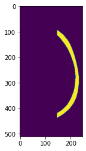

```python
import os
os.environ['CUDA_VISIBLE_DEVICES'] = '0'
```


```python
import matplotlib.pyplot as plt
import numpy as np
import sqlite3 as sql
import tensorflow as tf
from tensorflow import keras
from tensorflow.keras import layers
```


```python
import TrainData3 as mdb
```


```python
def GenTrainPair(com_data, imp_shape=None):
    x_rate = np.random.uniform(.05, 1.)
    y_rate = np.random.uniform(.25, .5)
    x_len = int(x_rate*com_data.shape[0])
    y_len = int(y_rate*com_data.shape[1])
    magic = np.random.uniform(0., 1.)
    if magic < .25:
        x_pos = 0
    elif magic > .75:
        x_pos = com_data.shape[0]-x_len
    else:
        x_pos = int(np.random.uniform(0, com_data.shape[0]-x_len))
    if imp_shape is None:
        imp_data = np.zeros_like(com_data)
    else:
        imp_data = np.zeros(imp_shape, dtype='bool')
    imp_data[x_pos:x_pos+x_len, -y_len:] = com_data[x_pos:x_pos+x_len, -y_len:]
    def_data = com_data
    def_data[x_pos:x_pos+x_len, -y_len:] = 0.
    return def_data.astype('float32'), imp_data.astype('float32')
```


```python
def GenTrainPair2(com_data, imp_shape=None, train=False):
    if train == True:
        y_rate = np.random.uniform(.1, .5)
    else:
        y_rate = .3
    y_len = int(y_rate*com_data.shape[1])
    if imp_shape is None:
        imp_data = np.zeros_like(com_data)
    else:
        imp_data = np.zeros(imp_shape, dtype='bool')
    imp_data[:, -y_len:] = com_data[:, -y_len:]
    def_data = com_data
    def_data[:, -y_len:] = 0.
    return def_data.astype('float32'), imp_data.astype('float32')
```


```python
class Data_Generator(keras.utils.Sequence):
    def __init__(self, ID_list, frac=1, train=True, batch_size=8):
        self.batch_size = batch_size
        self.ID_list = ID_list
        self.frac = frac
        self.train = train
        self.index_list = np.arange(len(ID_list))
        self.on_epoch_end()
    def __len__(self):
        return len(self.index_list)//(self.batch_size*self.frac)
    def __getitem__(self, k):
        conn = sql.connect(mdb.database_path, detect_types=sql.PARSE_DECLTYPES)
        ks = k*self.batch_size
        kt = ks+self.batch_size
        x = np.empty((self.batch_size, 512, 512), dtype='float32')
        y = np.empty((self.batch_size, 512, 512), dtype='float32')
        for i, index in enumerate(self.index_list[ks:kt]):
            ID = self.ID_list[index]        
            if self.train == True:
                com_img = mdb.get_item('com_ext', 'd2_slc', ID, new_conn=conn)
                def_img, imp_img = GenTrainPair2(com_img, imp_shape=(512, 512), train=True)
            else:
                # def_img = mdb.get_item('def_ext', 'd2_slc', ID, new_conn=conn)
                # imp_img = mdb.get_item('imp_ext', 'd2_slc', ID, new_conn=conn)
                com_img = mdb.get_item('com_ext', 'd2_slc', ID, new_conn=conn)
                def_img, imp_img = GenTrainPair2(com_img, imp_shape=(512, 512), train=False)
            x[i] = def_img
            y[i] = imp_img
        return x, y
    def on_epoch_end(self):
        np.random.shuffle(self.index_list)
```


```python
def SEBlock2(x, sq_rate=4):
    inp_x = x
    filters = x.shape[-1]
    x = layers.GlobalAveragePooling2D()(x)
    x = layers.Reshape((filters, ))(x)
    x = layers.Dense(filters//sq_rate)(x)
    x = layers.LeakyReLU(.2)(x)
    x = layers.Dense(filters, activation='sigmoid')(x)
    x = tf.nn.softmax(x)
    x = layers.Reshape((1, 1, filters))(x)
    x = inp_x * x
    return x
```


```python
def SEBlock(x, sq_rate=4):
    inp_x = x
    filters = x.shape[-1]
    x = layers.GlobalAveragePooling2D()(x)
    x = layers.Reshape((filters, ))(x)
    x = layers.Dense(filters//sq_rate)(x)
    x = layers.LeakyReLU(.3)(x)
    x = layers.Dense(filters, activation='sigmoid')(x)
    x = tf.nn.softmax(x)
    x = layers.Reshape((1, 1, filters))(x)
    x = inp_x * x * filters
    return x
```


```python
def ChannelGainInit(shape, dtype=None):
    print(shape, dtype)
    return 128*tf.ones(shape, dtype=dtype)
```


```python
class ChannelGain(layers.Layer):
    def __init__(self, ini_val):
        super().__init__()
        self.ini_val = ini_val
    def build(self, input_shape):
        self.gain = self.add_weight(
            shape=(1, ),
            initializer=ChannelGainInit,
            trainable=True
        )
    def call(self, inputs):
        return inputs * self.gain
    def get_config(self):
        return {'ini_val': self.ini_val}
```


```python
def LeakyConv2D(x, f, ks, st=1, pd='same', dr=1):
    x = layers.Conv2D(f, ks, strides=st, padding=pd, dilation_rate=dr)(x)
    x = layers.LeakyReLU(.2)(x)
    return x
```


```python
def LeakyConv2DT(x, f, ks, st=1, pd='same', dr=1):
    x = layers.Conv2DTranspose(f, ks, strides=st, padding=pd, dilation_rate=dr)(x)
    x = layers.LeakyReLU(.2)(x)
    return x
```


```python
def InceptionHead(shape, f):
    ginp_x = layers.Input(shape)
    x = ginp_x
    x = LeakyConv2D(x, f, 3, st=2)
    x = LeakyConv2D(x, f, 3)
    x = LeakyConv2D(x, f*2, 3)
    inp_x = x
    out_x = []
    # Path 1
    x = inp_x
    x = layers.MaxPooling2D(3, strides=2, padding='same')(x)
    out_x.append(x)
    # Path_2
    x = inp_x
    x = LeakyConv2D(x, f*3, 3, st=2)
    out_x.append(x)
    # Combine
    x = layers.Concatenate()(out_x)
    inp_x = x
    out_x = []
    # Path 1
    x = inp_x
    x = LeakyConv2D(x, f*2, 1)
    x = LeakyConv2D(x, f*3, 3)
    out_x.append(x)
    # Path 2
    x = inp_x
    x = LeakyConv2D(x, f*2, 1)
    x = LeakyConv2D(x, f*2, (1, 7))
    x = LeakyConv2D(x, f*2, (7, 1))
    x = LeakyConv2D(x, f*3, 3)
    out_x.append(x)
    # Combine
    x = layers.Concatenate()(out_x)
    inp_x = x
    out_x = []
    # Path 1
    x = inp_x
    x = LeakyConv2D(x, f*6, 3, st=2)
    out_x.append(x)
    # Path 2
    x = inp_x
    x = layers.MaxPooling2D(2)(x)
    out_x.append(x)
    # Combine
    x = layers.Concatenate()(out_x)
    return keras.Model(ginp_x, x)
```


```python
def InceptionA(shape, f):
    ginp_x = layers.Input(shape)
    x = ginp_x
    inp_x = x
    out_x = []
    # Path 1
    x = inp_x
    ori_shape = x.shape[1:-1]
    ori_filters = x.shape[-1]
    x = layers.GlobalAveragePooling2D()(x)
    x = layers.Reshape((1, 1, ori_filters))(x)
    x = layers.UpSampling2D(ori_shape)(x)
    x = LeakyConv2D(x, f*3, 1)
    out_x.append(x)
    # Path 2
    x = inp_x
    x = LeakyConv2D(x, f*3, 1)
    out_x.append(x)
    # Path 3
    x = inp_x
    x = LeakyConv2D(x, f*2, 1)
    x = LeakyConv2D(x, f*3, 3)
    out_x.append(x)
    # Path 4
    x = inp_x
    x = LeakyConv2D(x, f*2, 1)
    x = LeakyConv2D(x, f*3, 3)
    x = LeakyConv2D(x, f*3, 3)
    out_x.append(x)
    # Combine
    x = layers.Concatenate()(out_x)
    return keras.Model(ginp_x, x)
```


```python
def InceptionB(shape):
    ginp_x = layers.Input(shape)
    f = shape[-1]//8
    x = ginp_x
    inp_x = x
    out_x = []
    # Path 1
    x = inp_x
    ori_shape = x.shape[1:-1]
    ori_filters = x.shape[-1]
    x = layers.GlobalAveragePooling2D()(x)
    x = layers.Reshape((1, 1, ori_filters))(x)
    x = layers.UpSampling2D(ori_shape)(x)
    x = LeakyConv2D(x, f*2, 1)
    # out_x.append(x)
    # Path 2
    x = inp_x
    x = LeakyConv2D(x, f*6, 1)
    # out_x.append(x)
    # Path 3
    x = inp_x
    # x = LeakyConv2D(x, f*3, 1)
    x = LeakyConv2D(x, f*4, (1, 7))
    x = LeakyConv2D(x, f*4, (7, 1))
    out_x.append(x)
    # Path 4
    x = inp_x
    # x = LeakyConv2D(x, f*3, 1)
    x = LeakyConv2D(x, f*4, (1, 7))
    x = LeakyConv2D(x, f*4, (7, 1))
    x = LeakyConv2D(x, f*4, (1, 7))
    x = LeakyConv2D(x, f*4, (7, 1))
    out_x.append(x)
    # Combine
    x = layers.Concatenate()(out_x)
    return keras.Model(ginp_x, x)
```


```python
def InceptionC(shape, f):
    ginp_x = layers.Input(shape)
    x = ginp_x
    inp_x = x
    out_x = []
    # Path 1
    x = inp_x
    ori_shape = x.shape[1:-1]
    ori_filters = x.shape[-1]
    x = layers.GlobalAveragePooling2D()(x)
    x = layers.Reshape((1, 1, ori_filters))(x)
    x = layers.UpSampling2D(ori_shape)(x)
    x = LeakyConv2D(x, f*4, 1)
    out_x.append(x)
    # Path 2
    x = inp_x
    x = LeakyConv2D(x, f*4, 1)
    out_x.append(x)
    # Path 3
    x = inp_x
    x = LeakyConv2D(x, f*6, 1)
    inp2_x = x
    # Path L
    x = inp2_x
    x = LeakyConv2D(x, f*4, (1, 3))
    out_x.append(x)
    # Path R
    x = inp2_x
    x = LeakyConv2D(x, f*4, (3, 1))
    out_x.append(x)
    # Path 4
    x = inp_x
    x = LeakyConv2D(x, f*6, 1)
    x = LeakyConv2D(x, f*8, (1, 3))
    x = LeakyConv2D(x, f*8, (3, 1))
    inp2_x = x
    # Path L
    x = inp2_x
    x = LeakyConv2D(x, f*4, (1, 3))
    out_x.append(x)
    # Path R
    x = inp2_x
    x = LeakyConv2D(x, f*4, (3, 1))
    out_x.append(x)
    # Combine
    x = layers.Concatenate()(out_x)
    return keras.Model(ginp_x, x)    
```


```python
def ReductionA(shape, f):
    ginp_x = layers.Input(shape)
    x = ginp_x
    inp_x = x
    out_x = []
    # Path 1
    x = inp_x
    x = layers.MaxPooling2D(3, strides=2, padding='same')(x)
    out_x.append(x)
    # Path 2
    x = inp_x
    x = LeakyConv2D(x, f*3, 1, st=2)
    out_x.append(x)
    # Path 3
    x = inp_x
    x = LeakyConv2D(x, f*2, 1)
    x = LeakyConv2D(x, f*2, 3)
    x = LeakyConv2D(x, f*3, 3, st=2)
    out_x.append(x)
    # Combine
    x = layers.Concatenate()(out_x)
    return keras.Model(ginp_x, x)
```


```python
def ReductionB(shape, f):
    ginp_x = layers.Input(shape)
    x = ginp_x
    inp_x = x
    out_x = []
    # Path 1
    x = inp_x
    x = layers.MaxPooling2D(3, strides=2, padding='same')(x)
    # out_x.append(x)
    # Path 2
    x = inp_x
    # x = LeakyConv2D(x, f*3, 1)
    x = LeakyConv2D(x, f*3, 3, st=2)
    out_x.append(x)
    # Path 3
    x = inp_x
    # x = LeakyConv2D(x, f*4, 1)
    x = LeakyConv2D(x, f*4, (1, 7))
    x = LeakyConv2D(x, f*4, (7, 1))
    x = LeakyConv2D(x, f*5, 3, st=2)
    out_x.append(x)
    # Combine
    x = layers.Concatenate()(out_x)
    return keras.Model(ginp_x, x)
```


```python
def UpSampleA(shape, f):
    ginp_x = layers.Input(shape)
    x = ginp_x
    x = LeakyConv2DT(x, f*5, 3, st=2)
    x = LeakyConv2DT(x, f*5, (7, 1))
    x = LeakyConv2DT(x, f*5, (1, 7))
    # x = LeakyConv2DT(x, f*4, 1)
    return keras.Model(ginp_x, x)
```


```python
def get_size(shape):
    ret = 1
    for k in shape:
        ret *= k
    return ret
```


```python
def FengHeGuai():
    ginp_x = layers.Input((512, 512))
    x = ginp_x
    x = layers.Reshape((512, 512, 1))(x)
    # Encoder
    ks = [5, 5, 5, 7, 7]
    ef = [4, 8, 16, 32, 128]
    for d, f in enumerate(ef):
        x = LeakyConv2D(x, f, ks=ks[d])
        if d == len(ef)-2:
            tmp_x = x
        if d != len(ef)-1:
            x = LeakyConv2D(x, f, ks=ks[d], st=2)
        else:
            x = LeakyConv2D(x, f, ks=ks[d])
    # Decoder
    x = SEBlock(x, sq_rate=8)
    ks = [7, 7, 5, 5, 5]
    df = [128, 32, 16, 8, 4]
    for d, f in enumerate(df):
        if d == 1:
            tmp_x = LeakyConv2D(tmp_x, 128, 3, st=2)
            tmp_x = LeakyConv2D(tmp_x, 128, 3)
            tmp_x = SEBlock(tmp_x, sq_rate=8)
            x = layers.Lambda(lambda x: x[0]*x[1])([x, tmp_x])
        if d != 0:
            x = layers.UpSampling2D(2)(x)
            x = LeakyConv2D(x, f, ks=ks[d])
        else:
            x = LeakyConv2D(x, f, ks=ks[d])
        x = LeakyConv2D(x, f, ks=ks[d])
    x = LeakyConv2D(x, 1, ks=3)
    x = tf.sigmoid(x)
    x = layers.Reshape((512, 512))(x)
    return keras.Model(ginp_x, x)
```


```python
model = FengHeGuai()
model.summary()
```

    Model: "model"
    __________________________________________________________________________________________________
    Layer (type)                    Output Shape         Param #     Connected to                     
    ==================================================================================================
    input_1 (InputLayer)            [(None, 512, 512)]   0                                            
    __________________________________________________________________________________________________
    reshape (Reshape)               (None, 512, 512, 1)  0           input_1[0][0]                    
    __________________________________________________________________________________________________
    conv2d (Conv2D)                 (None, 512, 512, 4)  104         reshape[0][0]                    
    __________________________________________________________________________________________________
    leaky_re_lu (LeakyReLU)         (None, 512, 512, 4)  0           conv2d[0][0]                     
    __________________________________________________________________________________________________
    conv2d_1 (Conv2D)               (None, 256, 256, 4)  404         leaky_re_lu[0][0]                
    __________________________________________________________________________________________________
    leaky_re_lu_1 (LeakyReLU)       (None, 256, 256, 4)  0           conv2d_1[0][0]                   
    __________________________________________________________________________________________________
    conv2d_2 (Conv2D)               (None, 256, 256, 8)  808         leaky_re_lu_1[0][0]              
    __________________________________________________________________________________________________
    leaky_re_lu_2 (LeakyReLU)       (None, 256, 256, 8)  0           conv2d_2[0][0]                   
    __________________________________________________________________________________________________
    conv2d_3 (Conv2D)               (None, 128, 128, 8)  1608        leaky_re_lu_2[0][0]              
    __________________________________________________________________________________________________
    leaky_re_lu_3 (LeakyReLU)       (None, 128, 128, 8)  0           conv2d_3[0][0]                   
    __________________________________________________________________________________________________
    conv2d_4 (Conv2D)               (None, 128, 128, 16) 3216        leaky_re_lu_3[0][0]              
    __________________________________________________________________________________________________
    leaky_re_lu_4 (LeakyReLU)       (None, 128, 128, 16) 0           conv2d_4[0][0]                   
    __________________________________________________________________________________________________
    conv2d_5 (Conv2D)               (None, 64, 64, 16)   6416        leaky_re_lu_4[0][0]              
    __________________________________________________________________________________________________
    leaky_re_lu_5 (LeakyReLU)       (None, 64, 64, 16)   0           conv2d_5[0][0]                   
    __________________________________________________________________________________________________
    conv2d_6 (Conv2D)               (None, 64, 64, 32)   25120       leaky_re_lu_5[0][0]              
    __________________________________________________________________________________________________
    leaky_re_lu_6 (LeakyReLU)       (None, 64, 64, 32)   0           conv2d_6[0][0]                   
    __________________________________________________________________________________________________
    conv2d_7 (Conv2D)               (None, 32, 32, 32)   50208       leaky_re_lu_6[0][0]              
    __________________________________________________________________________________________________
    leaky_re_lu_7 (LeakyReLU)       (None, 32, 32, 32)   0           conv2d_7[0][0]                   
    __________________________________________________________________________________________________
    conv2d_8 (Conv2D)               (None, 32, 32, 128)  200832      leaky_re_lu_7[0][0]              
    __________________________________________________________________________________________________
    leaky_re_lu_8 (LeakyReLU)       (None, 32, 32, 128)  0           conv2d_8[0][0]                   
    __________________________________________________________________________________________________
    conv2d_9 (Conv2D)               (None, 32, 32, 128)  802944      leaky_re_lu_8[0][0]              
    __________________________________________________________________________________________________
    leaky_re_lu_9 (LeakyReLU)       (None, 32, 32, 128)  0           conv2d_9[0][0]                   
    __________________________________________________________________________________________________
    global_average_pooling2d (Globa (None, 128)          0           leaky_re_lu_9[0][0]              
    __________________________________________________________________________________________________
    conv2d_12 (Conv2D)              (None, 32, 32, 128)  36992       leaky_re_lu_6[0][0]              
    __________________________________________________________________________________________________
    reshape_1 (Reshape)             (None, 128)          0           global_average_pooling2d[0][0]   
    __________________________________________________________________________________________________
    leaky_re_lu_13 (LeakyReLU)      (None, 32, 32, 128)  0           conv2d_12[0][0]                  
    __________________________________________________________________________________________________
    dense (Dense)                   (None, 16)           2064        reshape_1[0][0]                  
    __________________________________________________________________________________________________
    conv2d_13 (Conv2D)              (None, 32, 32, 128)  147584      leaky_re_lu_13[0][0]             
    __________________________________________________________________________________________________
    leaky_re_lu_10 (LeakyReLU)      (None, 16)           0           dense[0][0]                      
    __________________________________________________________________________________________________
    leaky_re_lu_14 (LeakyReLU)      (None, 32, 32, 128)  0           conv2d_13[0][0]                  
    __________________________________________________________________________________________________
    dense_1 (Dense)                 (None, 128)          2176        leaky_re_lu_10[0][0]             
    __________________________________________________________________________________________________
    global_average_pooling2d_1 (Glo (None, 128)          0           leaky_re_lu_14[0][0]             
    __________________________________________________________________________________________________
    tf_op_layer_Softmax (TensorFlow [(None, 128)]        0           dense_1[0][0]                    
    __________________________________________________________________________________________________
    reshape_3 (Reshape)             (None, 128)          0           global_average_pooling2d_1[0][0] 
    __________________________________________________________________________________________________
    reshape_2 (Reshape)             (None, 1, 1, 128)    0           tf_op_layer_Softmax[0][0]        
    __________________________________________________________________________________________________
    dense_2 (Dense)                 (None, 16)           2064        reshape_3[0][0]                  
    __________________________________________________________________________________________________
    tf_op_layer_mul (TensorFlowOpLa [(None, 32, 32, 128) 0           leaky_re_lu_9[0][0]              
                                                                     reshape_2[0][0]                  
    __________________________________________________________________________________________________
    leaky_re_lu_15 (LeakyReLU)      (None, 16)           0           dense_2[0][0]                    
    __________________________________________________________________________________________________
    tf_op_layer_mul_1 (TensorFlowOp [(None, 32, 32, 128) 0           tf_op_layer_mul[0][0]            
    __________________________________________________________________________________________________
    dense_3 (Dense)                 (None, 128)          2176        leaky_re_lu_15[0][0]             
    __________________________________________________________________________________________________
    conv2d_10 (Conv2D)              (None, 32, 32, 128)  802944      tf_op_layer_mul_1[0][0]          
    __________________________________________________________________________________________________
    tf_op_layer_Softmax_1 (TensorFl [(None, 128)]        0           dense_3[0][0]                    
    __________________________________________________________________________________________________
    leaky_re_lu_11 (LeakyReLU)      (None, 32, 32, 128)  0           conv2d_10[0][0]                  
    __________________________________________________________________________________________________
    reshape_4 (Reshape)             (None, 1, 1, 128)    0           tf_op_layer_Softmax_1[0][0]      
    __________________________________________________________________________________________________
    conv2d_11 (Conv2D)              (None, 32, 32, 128)  802944      leaky_re_lu_11[0][0]             
    __________________________________________________________________________________________________
    tf_op_layer_mul_2 (TensorFlowOp [(None, 32, 32, 128) 0           leaky_re_lu_14[0][0]             
                                                                     reshape_4[0][0]                  
    __________________________________________________________________________________________________
    leaky_re_lu_12 (LeakyReLU)      (None, 32, 32, 128)  0           conv2d_11[0][0]                  
    __________________________________________________________________________________________________
    tf_op_layer_mul_3 (TensorFlowOp [(None, 32, 32, 128) 0           tf_op_layer_mul_2[0][0]          
    __________________________________________________________________________________________________
    lambda (Lambda)                 (None, 32, 32, 128)  0           leaky_re_lu_12[0][0]             
                                                                     tf_op_layer_mul_3[0][0]          
    __________________________________________________________________________________________________
    up_sampling2d (UpSampling2D)    (None, 64, 64, 128)  0           lambda[0][0]                     
    __________________________________________________________________________________________________
    conv2d_14 (Conv2D)              (None, 64, 64, 32)   200736      up_sampling2d[0][0]              
    __________________________________________________________________________________________________
    leaky_re_lu_16 (LeakyReLU)      (None, 64, 64, 32)   0           conv2d_14[0][0]                  
    __________________________________________________________________________________________________
    conv2d_15 (Conv2D)              (None, 64, 64, 32)   50208       leaky_re_lu_16[0][0]             
    __________________________________________________________________________________________________
    leaky_re_lu_17 (LeakyReLU)      (None, 64, 64, 32)   0           conv2d_15[0][0]                  
    __________________________________________________________________________________________________
    up_sampling2d_1 (UpSampling2D)  (None, 128, 128, 32) 0           leaky_re_lu_17[0][0]             
    __________________________________________________________________________________________________
    conv2d_16 (Conv2D)              (None, 128, 128, 16) 12816       up_sampling2d_1[0][0]            
    __________________________________________________________________________________________________
    leaky_re_lu_18 (LeakyReLU)      (None, 128, 128, 16) 0           conv2d_16[0][0]                  
    __________________________________________________________________________________________________
    conv2d_17 (Conv2D)              (None, 128, 128, 16) 6416        leaky_re_lu_18[0][0]             
    __________________________________________________________________________________________________
    leaky_re_lu_19 (LeakyReLU)      (None, 128, 128, 16) 0           conv2d_17[0][0]                  
    __________________________________________________________________________________________________
    up_sampling2d_2 (UpSampling2D)  (None, 256, 256, 16) 0           leaky_re_lu_19[0][0]             
    __________________________________________________________________________________________________
    conv2d_18 (Conv2D)              (None, 256, 256, 8)  3208        up_sampling2d_2[0][0]            
    __________________________________________________________________________________________________
    leaky_re_lu_20 (LeakyReLU)      (None, 256, 256, 8)  0           conv2d_18[0][0]                  
    __________________________________________________________________________________________________
    conv2d_19 (Conv2D)              (None, 256, 256, 8)  1608        leaky_re_lu_20[0][0]             
    __________________________________________________________________________________________________
    leaky_re_lu_21 (LeakyReLU)      (None, 256, 256, 8)  0           conv2d_19[0][0]                  
    __________________________________________________________________________________________________
    up_sampling2d_3 (UpSampling2D)  (None, 512, 512, 8)  0           leaky_re_lu_21[0][0]             
    __________________________________________________________________________________________________
    conv2d_20 (Conv2D)              (None, 512, 512, 4)  804         up_sampling2d_3[0][0]            
    __________________________________________________________________________________________________
    leaky_re_lu_22 (LeakyReLU)      (None, 512, 512, 4)  0           conv2d_20[0][0]                  
    __________________________________________________________________________________________________
    conv2d_21 (Conv2D)              (None, 512, 512, 4)  404         leaky_re_lu_22[0][0]             
    __________________________________________________________________________________________________
    leaky_re_lu_23 (LeakyReLU)      (None, 512, 512, 4)  0           conv2d_21[0][0]                  
    __________________________________________________________________________________________________
    conv2d_22 (Conv2D)              (None, 512, 512, 1)  37          leaky_re_lu_23[0][0]             
    __________________________________________________________________________________________________
    leaky_re_lu_24 (LeakyReLU)      (None, 512, 512, 1)  0           conv2d_22[0][0]                  
    __________________________________________________________________________________________________
    tf_op_layer_Sigmoid (TensorFlow [(None, 512, 512, 1) 0           leaky_re_lu_24[0][0]             
    __________________________________________________________________________________________________
    reshape_5 (Reshape)             (None, 512, 512)     0           tf_op_layer_Sigmoid[0][0]        
    ==================================================================================================
    Total params: 3,166,841
    Trainable params: 3,166,841
    Non-trainable params: 0
    __________________________________________________________________________________________________
    


```python
def dice_loss(y_true, y_pred, smooth=1.):
    intersection = tf.reduce_sum(tf.abs(y_true*y_pred))
    return 1-(2.*intersection)/(tf.reduce_sum(tf.square(y_true))+tf.reduce_sum(tf.square(y_pred))+smooth)
```


```python
model.compile(optimizer=keras.optimizers.Adam(learning_rate=.0005, clipnorm=1.), loss=dice_loss)
```


```python
model.compile(optimizer=keras.optimizers.SGD(learning_rate=0.00005, clipnorm=1.), loss=dice_loss)
```


```python
t_imp_list = [ID for i in range(70) for ID in mdb.get_id_list('item_id', 'd2_slc', obj_id=i, level=512)]
```


```python
v_imp_list = [ID for i in range(70, 100) for ID in mdb.get_id_list('item_id', 'd2_slc', obj_id=i, level=512)]
```


```python
model.fit(
    x=Data_Generator(t_imp_list, frac=2, train=True, batch_size=8),
    validation_data=Data_Generator(v_imp_list, train=False, batch_size=8),
    epochs=5, verbose=1,
    callbacks=[
        keras.callbacks.ModelCheckpoint(
            filepath='model-{val_loss:04f}-{loss:04f}.h5',
            monitor='val_loss',
            save_best_only=False
        ),
    ]
)
```


```python
with open('fhg-12.json', 'w') as f:
    f.write(model.to_json())
```


```python
model.load_weights('model-0.092639-0.104101.h5')
```


```python
dg = Data_Generator(v_imp_list, frac=2, train=False, batch_size=1)
```


```python
x, y = dg[0]
```


```python
plt.imshow(x[0])
```


    <matplotlib.image.AxesImage at 0x7ff9a40e18e0>


```python
py = model.predict(x)[0]
```


```python
plt.imshow(np.abs(py[..., 0]) >= .5)
```


    <matplotlib.image.AxesImage at 0x7ff9a59be880>


```python
plt.imshow(y[0])
```


    <matplotlib.image.AxesImage at 0x7ff9a59d29d0>


```python
import nrrd
from skimage import transform, measure
```


```python
def get_valid_shape_d3(data):
    x_info = [np.any(data[x, ...]) for x in range(data.shape[0])]
    y_info = [np.any(data[:, y, :]) for y in range(data.shape[1])]
    z_info = [np.any(data[..., z]) for z in range(data.shape[2])]
    x_info = np.where(x_info)[0]
    y_info = np.where(y_info)[0]
    z_info = np.where(z_info)[0]
    return (x_info[0], x_info[-1]+1, y_info[0], y_info[-1]+1, z_info[0], z_info[-1]+1)
```


```python
def calc_geo_2d(data):
    data = data.astype('bool')
    x_info = [np.any(data[x, :]) for x in range(data.shape[0])]
    x_info = np.where(x_info)[0]
    x_min, x_max = x_info[0], x_info[-1]+1
    y_info = [np.any(data[:, y]) for y in range(data.shape[1])]
    y_info = np.where(y_info)[0]
    y_min, y_max = y_info[0], y_info[-1]+1
    return x_min, x_max, y_min, y_max
```


```python
def run_model(model, data):
    if type(data) == list:
        for k in range(len(data)):
            data[k] = np.expand_dims(data[k], 0)
    else:
        data = np.expand_dims(data, 0)
    ret = model.predict(data)
    if type(data) == list:
        for k in range(len(ret)):
            ret[k] = ret[k][0]
    else:
        ret = ret[0]
    return ret[..., 0]
```


```python
def get_valid_region_2d(data, geo_info):
    x_min, x_max, y_min, y_max = geo_info
    return data[x_min:x_max, y_min:y_max]
```


```python
def inv_resize_2d(data, ori_shape, geo_info):
    x_min, x_max, y_min, y_max = geo_info
    data = np.copy(data)
    data = transform.resize(data, (x_max-x_min, y_max-y_min))
    ori_img = np.zeros(ori_shape, dtype=data.dtype)
    ori_img[x_min:x_max, y_min:y_max] = data
    return ori_img
```


```python
def get_max_region(data):
    ret, num = measure.label(data, return_num=True)
    max_region = None
    max_count = 0
    for l in range(1, num+1):
        region = (ret==l)
        count = np.count_nonzero(region)
        if count > max_count:
            max_count = count
            max_region = region
    return max_region
```


```python
prefix = '/home/home/2020summer/training_set'
com_path = os.path.join(prefix, 'complete_skull', '099.nrrd')
com_data, _ = nrrd.read(com_path)
```


```python
d3_info = get_valid_shape_d3(com_data)
```


```python
def_data = np.copy(com_data)
def_data[..., -100:] = 0
imp_data = np.copy(com_data)
imp_data[..., :-100] = 0
```


```python
d3_info_imp = get_valid_shape_d3(imp_data)
```


```python
data = def_data
z_shape = data.shape[2]
data = data.astype('float32')
imp_2d_c = np.zeros((512, 512, 512), dtype='bool')
for slc_id in range(data.shape[0]):
    if not np.any(imp_data[slc_id]):
        continue
    data_2d = data[slc_id]
    geo_info_2d = calc_geo_2d(com_data[slc_id])
    data_2d_v = get_valid_region_2d(data_2d, geo_info_2d)
    data_2d_s = transform.resize(data_2d_v, (512, 512))
    imp_2d = run_model(model, data_2d_s)
    imp_2d = np.abs(imp_2d)
    imp_2d_inv_res = inv_resize_2d(imp_2d, (512, 512), geo_info_2d)
    imp_2d_inv_res = get_max_region(imp_2d_inv_res>=.5)
    imp_2d_c[slc_id] = imp_2d_inv_res
imp_2d_c = imp_2d_c[..., :z_shape]
```


```python
def calc_dsc(y, py):
    tp = np.count_nonzero(np.logical_and(y, py))
    _sum = np.count_nonzero(y)+np.count_nonzero(py)
    return 2*tp/_sum
```


```python
plt.imshow(imp_2d_c[300])
```


    <matplotlib.image.AxesImage at 0x7f1af46d6cd0>





```python
calc_dsc(imp_2d_c, imp_data)
```


    0.9012544074645427


```python
with open('large.npz', 'wb') as f:
    np.savez_compressed(f, x=def_data.astype('bool'), y=imp_data.astype('bool'), py=imp_2d_c.astype('bool'))
```


```python

```
